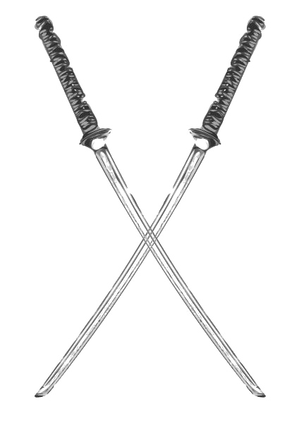

<a href="">
  
</a>


<h1 align="center"> 
    Turbo Katana 
</h1>
<h6 align="center">
An Object Oriented, Statically-Typed Programming Language. 
</h6>
<p align="center">
    
</p>


***

<br>
<br>

# Try it Yourself! 

## Dependencies

You can either build the project locally or use a ready-made Docker image to avoid installing the dependencies on your computer.

### Compiling the project locally

#### Compiling the interpreter
To run your programs you need to compile the interpreter located in the `interprete` folder.

 - Install Flex and Bison (`apt-get install flex bison` apt-based distros).
 - compile the interpreter
```
$ cd interprete
$ make clean
$ make
```

#### Compiling the compiler

Install and setup the [Opam package manager](https://opam.ocaml.org/). The rest of the dependencies are included in the `compil.opam` file and can be downloaded using the following command:

```
$ opam install . --deps-only
```

Then you can make sure everything works correctly by running the unitary tests using the following command:

```
$ dune runtest
```
If everything is well configured the command will display nothing.

Note: if you prefer to build without Dune, you can do so with the Makefile: Make sure to have `ocaml >= 4.10`, `menhir` and `ocamllex` installed. 
```
$ make
```
The executable will be located in `_build/compilc.exe`. /!\ Don't be fooled by the `.exe` extension, this is a Linux executable!

### Using Docker
If you don't want to download any external dpendencies, you can use docker to pull the dev-image from the GitHub Container Registry. All you have to do is run the following command:
```
$ docker run --rm -it ghcr.io/oopsoverflow/katana:latest
```

***
<br>

## Running Your First Turbo Katana Program

You can write your first program and run it using the following command:
```
$ dune exec compilc <path-to-prog.kat-here> > <path-to-output-file.txt>
```
For example running the `progs/gn.kat` program should give the following output:
```
$ dune exec compilc progs/gn.kat | interprete/interp
```
```ocaml
>>> Running Turbo Katana v1.0.1.b
>>> Target progs/gn.kat
dune exec compilc progs/gn.kat | interprete/interp
Nombre de termes pour representer 33259 => 2
33 259
1 123 456 789
7 230
32 400
39 630
39 630
32 400
39 630
1
0
1 000 000
Somme des entiers de 1 195160 100:
5 050
Table des factorielles de 1 a 30 :
1!  = 1
2!  = 2
3!  = 6
4!  = 24
5!  = 120
6!  = 720
7!  = 5 040
8!  = 40 320
9!  = 362 880
10! = 3 628 800
11! = 39 916 800
12! = 479 001 600
13! = 6 227 020 800
14! = 87 178 291 200
15! = 1 307 674 368 000
16! = 20 922 789 888 000
17! = 355 687 428 096 000
18! = 6 402 373 705 728 000
19! = 121 645 100 408 832 000
20! = 2 432 902 008 176 640 000
21! = 51 090 942 171 709 440 000
22! = 1 124 000 727 777 607 680 000
23! = 25 852 016 738 884 976 640 000
24! = 620 448 401 733 239 439 360 000
25! = 15 511 210 043 330 985 984 000 000
26! = 403 291 461 126 605 635 584 000 000
27! = 10 888 869 450 418 352 160 768 000 000
28! = 304 888 344 611 713 860 501 504 000 000
29! = 8 841 761 993 739 701 954 543 616 000 000
30! = 265 252 859 812 191 058 636 308 480 000 000
```

***
<br>

## Platforms
This project is platform-independent. It should run flawlessly on Linux, Windows and MacOS.

It was only tested on Windows and Linux nevertheless.

<br>


